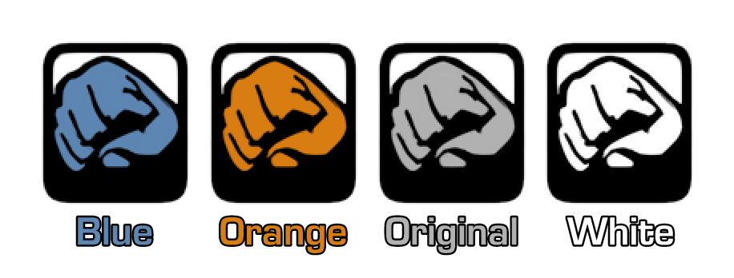

<div align="justify">

# PPSSPP - GTA Stories Weapon Icons Pack
<p align="center">
    
</p>

This texture pack for PPSSPP enhances the weapon icon textures in GTA: Liberty City Stories and GTA: Vice City Stories, increasing the resolution from 64x64 to 128x128.

In addition to the original gray (#FFB1B1B1) icons, there are the following variations:

- **Blue** (#FF5D86B2): Inspired by MP5K's icon found in GTA: LCS E3 Demo.
- **Orange** (#FFD97D12): Based on an unused tear gas icon from both games.
- **White** (#FFFFFFFF): Pure white, which is useful for creating new variations.

**Note:** The hex values ​​mentioned above represent the colors in the texture files. They will be a little different in the game.

## Installation

1. Download the texture pack ZIP of your choice from the [latest release](https://github.com/santiago046/ppsspp-gta-stories-weapon-icons-pack/releases/latest) page.
2. Open the ZIP file in PPSSPP as if it were a game.
3. Wait for the installation process to complete.

Make sure you have recently opened the chosen game before installing the pack to ensure a correct installation.

If you already have a texture pack installed, adjustments will be necessary at your own risk. I am not responsible for any losses or damages.

## Generation Script

The `build.py` script can be used to generate ZIP packs, offering options to select the hash type, useful for adapting to other texture packs.

### Usage

```
usage: build.py [-h] [-c <color>] [-r] [-t <type>] GAME

Build the ZIP texture pack

positional arguments:
  GAME                  set the game. Valid values are: LCS or VCS

options:
  -h, --help            show this help message and exit
  -c <color>, --icon-color <color>
                        choose the icons color. Valid values are: blue,
                        orange, original or white (default: original)
  -r, --reduce-hash     enable reducedHash in textures.ini file (default:
                        False)
  -t <type>, --hash-type <type>
                        set the hash type for textures.ini file. Valid values
                        are: xxh32 or xxh64 (default: xxh64)
```

### Examples

1. Generate with orange color, default hash type, and disabled hash reduction for LCS:
  ```
  ./build.py -c orange LCS
  ```

2. Generate with default color (original), hash type xxh32, and enabled hash reduction for VCS:
  ```
  ./build.py -r -t xxh32 VCS
  ```

3. Generate with white color, hash type xxh64, and disabled hash reduction for LCS:
  ```
  ./build.py -c white -t xxh64 LCS
  ```

4. Generate with blue color, hash type xxh32, and enabled hash reduction for VCS:
  ```
  ./build.py -c blue -r -t xxh64 VCS
  ```

## In-Game Screenshots

Click on them to see in full resolution.

<p align="middle">
    
    
</p>

</div>
